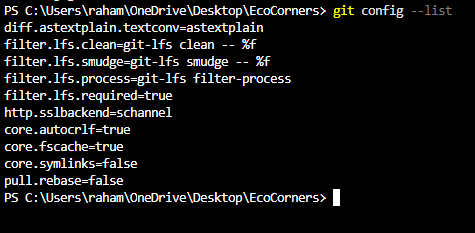
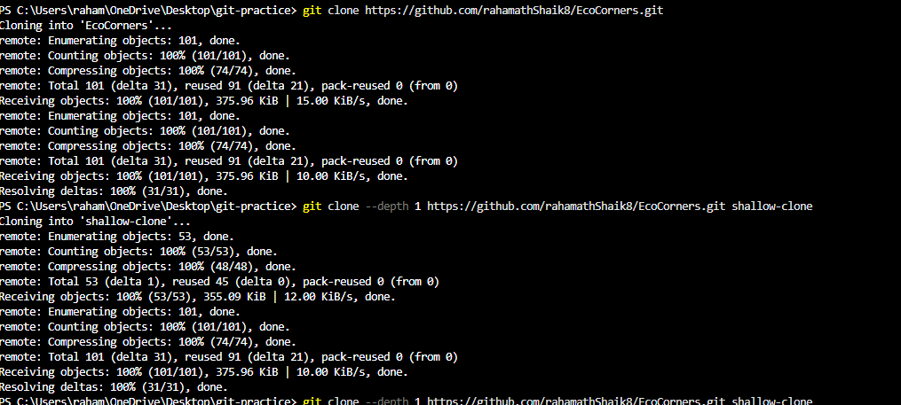

# Industry Level Git Commands Practice

Repository: EcoCorners

---

# 1. Git Configuration Commands

## git config --global user.name

Syntax:
git config --global user.name "Your Name"

Purpose:
Sets the username used for Git commits.

Example:
git config --global user.name "Rahamath"

Screenshot:
already done

---

## git config --global user.email

Syntax:
git config --global user.email "email@example.com"

Purpose:
Sets the email used for Git commits.

Example:
git config --global user.email "rahamath@email.com"

Screenshot:
already done

---

## git config --list

Syntax:
git config --list

Purpose:
Displays all Git configuration settings.

Example:
git config --list

Screenshot

## git config --unset

Syntax:
git config --unset <key>

Purpose:
Removes a configuration setting from Git.

Example:
git config --unset user.name
# 2. Repository Setup Commands

git init -initialize empty repository 
git clone - clone a repo
git clone --branch
git clone --depth

